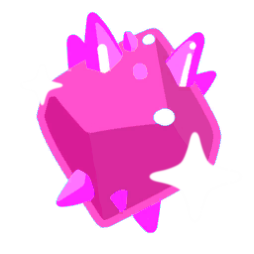
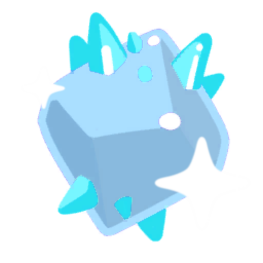

<h1 align="center">Gem Slimes</h1>

<p align="center">
  
  
  
  
  
</p>

<p align="center">
  <b>Five slimes cut from precious stone, and a chain that grows one into the next.</b>
</p>

---

## Install

1. Install [MelonLoader](https://melonwiki.xyz/) 0.7.x for Slime Rancher 2 and run the game once.
2. Drop `GemSlimesSR2.dll` into the game's `Mods` folder.

Optional: [`ModdedAssets`](../ModdedAssets) gives every gem its own icon.

## The gems

| Gem | Cut from | Plort value | Shatters on touch | Found in the wild |
|---|---|---:|:---:|:---:|
| Garnet | Crystal slime | 90 | yes | 2% of a crystal spawn |
| Sapphire | Rock slime | 125 | no | 4% of a rock spawn |
| Emerald | Rock slime | 300 | no | grown |
| Amethyst | Crystal slime | 450 | yes | grown |
| Diamond | Crystal slime | 600 | yes | grown |

<p align="center">
  
  
  
  
  
</p>

## The chain

Each step is a whole slime fed to another, which is what makes the chain expensive:

```
Sapphire  +  Lucky Slime   →  Emerald
Emerald   +  Garnet Slime  →  Amethyst
Amethyst  +  Gold Slime    →  Diamond
```

The crystal gems shatter into their plort when a rancher walks into one, and throw spikes in their
own colour. Every gem's favourite food is the mint mango, as in the original mod.

## Notes

- A gem is a clone of a vanilla `SlimeDefinition` — which in Slime Rancher 2 *is* the identifiable
  type — registered under `GemSlimes_Slime<Gem>`, the id a save file stores.
- Growth is resolved in a prefix on `SlimeEat.FinishChomp`: an eat map entry naming `BecomesIdent` is
  not enough, because the game only takes its transformation branch for meals it treats as largo
  material and sends a swallowed slime to the produce branch instead.
- `CrystalSlimeLaunch` holds the spike prefabs itself, so the launcher is pointed at the gem's own
  tinted pair — otherwise a garnet would throw crystal-slime blue.

## Build

Source lives in [`Source/GemSlimes`](../../Source/GemSlimes). Point the build at a Slime Rancher 2 install
with MelonLoader on it — `SR2_PATH`, or `-p:GamePath="…\Slime Rancher 2"` — then:

```bash
dotnet build "Source/GemSlimes/GemSlimesSR2.csproj" -c Release
```


## Credits

Original Slime Rancher 1 mod: **[Gem Slimes](https://www.nexusmods.com/slimerancher/mods/104)**, by **Bazzzzzzzzzzzzzzzzzzzz**.
Credit for it stays with its author.

Slime Rancher 2 adaptation by **Xiu_ma**, **PikaCat** and **Claude** (Anthropic).
