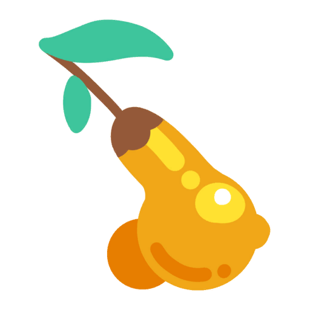

<h1 align="center">Kookadoba Ginger Grower</h1>

<p align="center">
  
</p>

<p align="center">
  <b>Gilded Ginger becomes a crop — plantable, carryable, and growing in the wild.</b>
</p>

---

## Install

1. Install [MelonLoader](https://melonwiki.xyz/) 0.7.x for Slime Rancher 2 and run the game once.
2. Drop `KookadobaGingerGrowerSR2.dll` into the game's `Mods` folder.

## What it does

| | |
|---|---|
| **Plantable** | Drop a ginger into a garden and it grows like any other veggie, deluxe garden included. |
| **Carryable** | Gilded Ginger belongs to no identifiable group in the base game, so the vacpack, the silos and the drones all refused it. It now joins the groups of an ordinary crop. |
| **Wild** | It comes up among the pogo fruit, worth 2% of a tree's table. |
| **Gold slime** | Ginger becomes its favourite food. Its diet is widened to fruit, veggies, meat and nectar, and it no longer eats plorts. |

## Notes

- A garden accepts a crop when its `GardenCatcher` lists a plant slot for it. The mod clones a
  vanilla veggie patch — soil, joints, audio and growth logic kept — and swaps the
  `ResourceGrowerDefinition` for one that yields ginger, then re-skins the sprouts with the ginger
  model.
- **Saving works**: a plot stores what is planted in it as an index into a table of grower reference
  ids, and the mod adds its two definitions to both directions of that translation.
- Wild patches are pointed at a *copy* of their grower definition. Those definitions are shared
  assets, so editing the originals would sow ginger in every garden too.
- A gold slime's bite at a plort is turned down in a prefix on `SlimeEat.MaybeChomp`: emptying the
  diet's edible-plort group did not hold up in play.

## Not ported

Slime Rancher 1's **Kookadoba** does not exist in Slime Rancher 2 — no identifiable, no patch node,
no model anywhere in the game's assemblies, only `GingerPatchNode`. The mod keeps its original name
for lineage; only the ginger half has something to grow here.

## Build

Source lives in [`Source/KookadobaGingerGrower`](../../Source/KookadobaGingerGrower). Fill the shared
[`Dependencies/`](../../Dependencies/README.md) folder, then:

```bash
dotnet build "Source/KookadobaGingerGrower/KookadobaGingerGrowerSR2.csproj" -c Release
```


## Credits

Original Slime Rancher 1 mod: **KookadobaGingerGrower**, by **MegaPiggy**. The mod itself is kept in
[`Mods SR1/KookadobaGingerGrower`](../../Mods%20SR1/KookadobaGingerGrower) for reference, and credit for it stays with its author.

Slime Rancher 2 adaptation by **Xiu_ma**, **PikaCat** and **Claude** (Anthropic).
