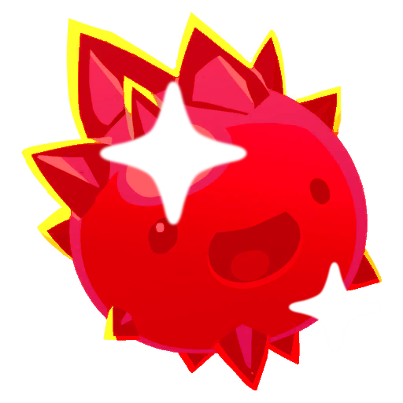

<h1 align="center">Modded Assets</h1>

<p align="center">
  
  
  
</p>

<p align="center">
  <b>Gives the ported mods icons of their own.</b>
</p>

---

## Install

1. Install [MelonLoader](https://melonwiki.xyz/) 0.7.x for Slime Rancher 2 and run the game once.
2. Drop `ModdedAssetsSR2.dll` into the game's `Mods` folder, next to the ported mods.

It is one-way on purpose: **no ported mod references this one.** Install it and the icons appear;
leave it out and every mod still works with vanilla icons.

## What it covers

| Mod | Icons |
|---|---|
| GemSlimes | 5 slimes + 5 plorts |
| TwinkleSlime | 2 slimes + 2 plorts |
| BubbleSlimes | slime + plort |
| LuckyPlorts | plort |

Seventeen in all. The log reports the split, for example `Applied 13 icons, rendered 0` followed by
`Applied 4 icons (0 modded types not registered yet)` — mods that load later are picked up on a retry.

## Notes

- Icons are embedded as raw RGBA32 (`.rgba`: width, height, then rows bottom-up) at 256 pixels.
  `ImageConversion.LoadImage` takes an `Il2CppSystem.ReadOnlySpan` that Il2CppInterop cannot marshal,
  so PNGs are converted offline instead of decoded at runtime.
- A `SlimeDefinition` reads its icon from its appearance, so the icon is written to both.
- If an asset is ever unreadable the mod photographs the object with an isolated camera rather than
  leave a modded type wearing the icon of the vanilla one it was cloned from.

## Build

Source and artwork live in [`Source/ModdedAssets`](../../Source/ModdedAssets). Fill the shared
[`Dependencies/`](../../Dependencies/README.md) folder, then:

```bash
dotnet build "Source/ModdedAssets/ModdedAssetsSR2.csproj" -c Release
```

To cover another mod, add its icon as `.rgba` under `assets/` and a line to the `Icons` table in
`src/Main.cs`. Converting a PNG:

```python
import struct
from PIL import Image

img = Image.open("icon.png").convert("RGBA")
img.thumbnail((256, 256), Image.LANCZOS)
flipped = img.transpose(Image.FLIP_TOP_BOTTOM)   # Unity uploads rows bottom-up
with open("icon.rgba", "wb") as f:
    f.write(struct.pack("<ii", *flipped.size))
    f.write(flipped.tobytes())
```

## Credits

Not a port: this companion mod was written by **Xiu_ma**, **PikaCat** and **Claude** (Anthropic) to serve
the Slime Rancher 1 mods adapted alongside it. It stands where **AssetsLib** by **Aidanamite** stood in
Slime Rancher 1 — that library is kept in [`Mods SR1/AssetsLib`](../../Mods%20SR1/AssetsLib) for
reference, but nothing here is derived from it.
